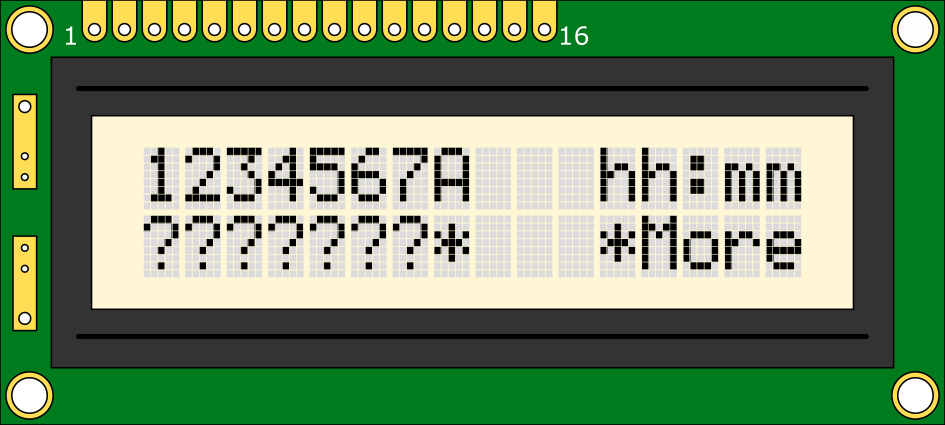
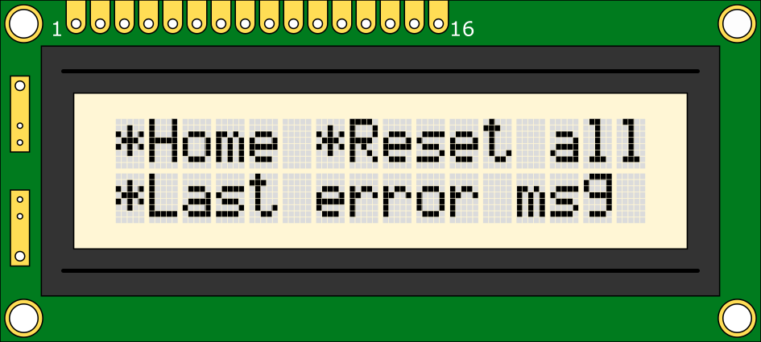
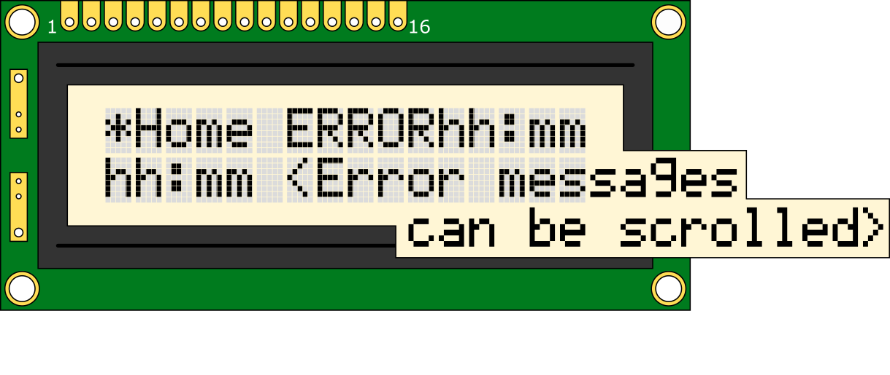

# Arduino Irrigation Controller Technical Notes
## Links
- [Home Page](../README.md)
- [User Guide](Documentation/UserGuide.md)
## Error Codes
Here is a list of possible error codes that will be displayed on the main controller's lcd display. All error messages start with the up time at which they were encountered followed by the details.

### `hh:mm Bays x,y,z Disconnected`
This is the most common error and is displayed when the controller does not recieve an acknowledgement from the bay outlet. If all bay outlets are effected, `All` will be displayed instead of outlet numbers. Check that everything is connected properly and turned on.

### `hh:mm `
Blah blah blah
## LCD Layout
The main controller currently uses a 16 by 2 alphanumeric lcd display. This works fairly well for displaying the seven bays that this system was designed for, however you might want to get a bigger 20 by 4 lcd and adapt the code if you plan on having more bays.

The `*` (Astrixes) are used as buttons and can be clicked on by using the left and right buttons to navigate the cursor (black line under a character) and the select button to click it.
#### Main Screen
```
                     \/ A is an option to control all bays at once.
Bay Number -> 1234567A   hh:mm
Bay Status -> ???????*   *More
```

#### More Options Screen
```
*Home *Reset All
*Last Error Msg
```

#### Error Message Screen
```
*Home ERRORhh:mm
<Error message here. It can be scrolled as well!>
```

## Communication
This system uses the PJON protocol using ThroughSerial over rs485. This protocol automatically handles error checking and making sure that packets go to where they need to go and are recieved. [Click Here](https://www.pjon.org/) to go to the PJON website.

The baud rate is set to 9600 by default. If there is large amount of data being lost, try slowing this down. The baud rate **must** be the same on all devices.

### Addresses
The bus id is set to 0.0.0.1 by default. It does not really matter as long as separate PJON networks are kept separate, but this can be changed as long as it is the same for all devices on this network.

The main controller's address is 255.

Slave addresses start at 40 for bay 1.
### Commands
The first byte of the payload in a packet contains the command. Subsequent bytes have the details.
#### `reportStatus` or `s`

The main controller sends this command when it first starts up to check which dbays are connected and see if they know their position (The main controller might be reset while everything else still has power...).
#### `overwriteStatus` or `w`
This is sent from a slave to the main controller to change what state it thinks it is in. this is used if a user presses the button on a bay outlet to change its position or after the slave has recieved a `reportStatus` command.

1 byte after the command contains the status.

#### `reset` or `x`
This is a broadcast command that should in theory reset the whole system.

#define setStatus "r"